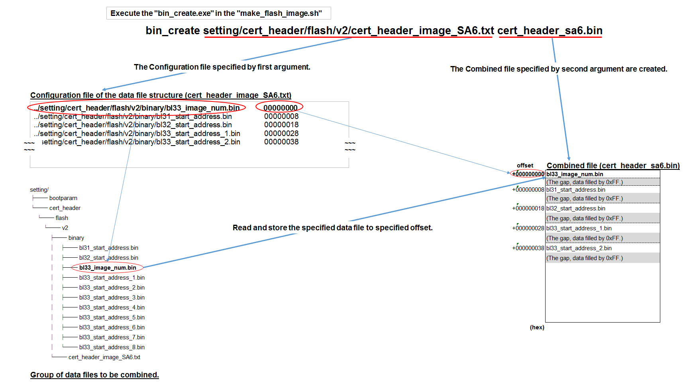

# 1. Overview  
---  
## 1.1. Overview  
This document explains the "ImageCreate".  
The "ImageCreate" is sample software for combining data placed at various offsets within a sector of the flash memory.  

Chapter 2 shows the operating environment.  
Chapter 3 describes the execution procedure.  
Chapter 4 explains the configuration.  
Chapter 5 supplements about the "make_flash_image_for_CR7.sh".  

## 1.2. Related Documents  
[1] Renesas Electronics Corp,. (2017, April 14). renesas-rcar/arm-trusted-firmware (IPL Rev.1.0.14 rev2).  https://github.com/renesas-rcar/arm-trusted-firmware  

## 1.3. Restrictions  
There is no restriction in this revision.  

# 2. Operating Environment  
---  
This sample software was confirmed to operate normally in the Ubuntu 14.04 LTS (64 bit) environment.  

# 3. Execution Procedure  
---  
## 3.1. build the "bin_create"  
If you have not yet built the "bin_create", then execute the "build_bin_create.sh".

```  
~/ImageCreate $ ./build_bin_create.sh  
```  

If successfully built, the "bin_create" will be stored in the "bin" folder.  
The "bin_create" is combine the binary data, according to specified two arguments.  

**./bin/bin_create configuration-file combined-filename**  

For first argument "configuration-file", specify the configuration file of data file structure.  
Refer to chapter 4 for the configuration file of data file structure details.  
For second argument "combined-filename", specify the data file name of combine result.  

## 3.2. Create the combined file  
If you execute the following command, then the combined file is created.  

```  
~/ImageCreate $ ./make_flash_image.sh  
```  

In the "make_flash_image.sh", the "bin_create" and the objcopy is executed.  
The "bin_create" combines binary data, and the objcopy converts from binary format to s-record format.  

As result of execution, following files are output to the "output" folder.  

- **bootparam_sa0.srec**  
- **cert_header_sa6.srec**  

In "make_flash_image.sh", samples for combining parameter sets referenced from the BootROM and the IPL are set as defaults.  
These parameter sets are example for booting the IPL on the execution environment (target board).  
The BootROM is the boot rom of the IPL execution environment (target board), and it is boot the IPL.  
The link to the IPL is shown in clause 1.2 Related Documents a).  

# 4. Configuration  
---  
## 4.1. The configuration file of data file structure  
The configuration file of data file structure is specified by first argument of the "bin_create".  
The default setting of the "make_flash_image.sh" is specified as follows.  

**setting/bootparam/v2/bootparam_image_SA0.txt**  
**setting/cert_header/flash/v2/cert_header_image_SA6.txt**  

Note: If your SoC product is "H3 ver1.0", "H3 ver1.1" or "M3 ver1.0", please use "setting/bootparam/v1/bootparam_image_SA0.txt" instead.

The configuration file of data file structure is very simple.  
Just specify the data file and offset to be combined on each line.  

The following figure shows the relationship between the file specified in the configuration file of data file structure and the combined file.  

  

**_Figure 1. Relationship of the configuration file of data file structure and the combined file_**  

When "make_flash_image.sh" is executed, data is combined with the combined file as follows.  

1. The "bin_create" reads one line of the configuration file of data file structure.  
2. Reads the file specified in the read line and stores it in the offset position of the Combined file.  
3. Repeat steps 1 and 2 until all lines of the Configuration file of data file structure have been read.  

The configuration file of data file structure is specified by first argument of the "bin_create".  

Combined file name is specified by second argument of the "bin_create".  

The "bin_create" is executed from the "make_flash_image.sh".  

## 4.2. Store the data files  
Before executing the "make_flash_image.sh", store the data files to be combined.  
As shown in Figure 1, it is necessary to store all the data files specified in each line of the configuration file of data file structure.  

## 4.3. Default configuration  
In the "cert_header_image_SA6.txt", the parameters set for each line are as follows.  

|Data file|Offset|  
|--|---|  
|../setting/cert_header/flash/v2/binary/bl33_image_num.bin|00000000|  
|../setting/cert_header/flash/v2/binary/bl31_start_address.bin|00000008|  
|../setting/cert_header/flash/v2/binary/bl32_start_address.bin|00000018|  
|../setting/cert_header/flash/v2/binary/bl33_start_address_1.bin|00000028|  
|../setting/cert_header/flash/v2/binary/bl33_start_address_2.bin|00000038|  
|../setting/cert_header/flash/v2/binary/bl33_start_address_3.bin|00000048|  
|../setting/cert_header/flash/v2/binary/bl33_start_address_4.bin|00000058|  
|../setting/cert_header/flash/v2/binary/bl33_start_address_5.bin|00000068|  
|../setting/cert_header/flash/v2/binary/bl33_start_address_6.bin|00000078|  
|../setting/cert_header/flash/v2/binary/bl33_start_address_7.bin|00000088|  
|../setting/cert_header/flash/v2/binary/bl33_start_address_8.bin|00000098|  
|...|...|  
|...|...|  

The default configuration file of data file structure is set for the HyperFlash boot of the IPL Rev1.0.14 rev2.  
The setting values and the data structure may differ depends version of the IPL.  

For details, refer to the Related Documents [1].  

## 4.4. Points to note when create/update the Configuration file  
- Must describe the data file path from beginning of the line.  
- The data file is read as raw binary data.  
- Only the "space" character (ASCII 0x20) can be written between data file and offset. (The Tab character (ASCII 0x09) cannot be used)  
- Lines beginning with # are treated as empty lines. (Available as comments)  
- The gap (the part where data is not specified by the configuration of data structure) of the combined data is filled with 0xFF.  
- Overlapping due to offset and read data size is not checked.  

# 5 About the "make_flash_image_for_CR7.sh"  
---  
The "make_flash_image_for_CR7.sh" is for creating combined data of the IPL for CR7.  
The "ImageCreate" also includes the configuration for that.  

## 5.1. Execution procedure  
Execute the "make_flash_image_for_CR7.sh" instead of the "make_flash_image.sh" in clause 3.2 execution procedure.  
```  
~/ImageCreate $ ./make_flash_image_for_CR7.sh  
```  

As result of execution, following files are output to the "output" folder.  

- **bootparam_sa0.srec**  
- **cert_header_sa3.srec**  
- **cert_header_sa6.srec**  

The difference from the "make_flash_image.sh" is that the "cert_header_sa3.srec" is create.  
Therefore the IPL for CR7 is used the more information.

## 5.2. The configuration file of data file structure  
The default setting of the "make_flash_image_for_CR7.sh" is specified as follows.  

**setting/CR7/bootparam/v2/bootparam_image_SA0.txt**  
**setting/CR7/cert_header/flash/v2/cert_header_image_SA3.txt**  
**setting/CR7/cert_header/flash/v2/cert_header_image_SA6.txt**  

The remaining explanation is like that of chapter 4, so it is omitted.  
